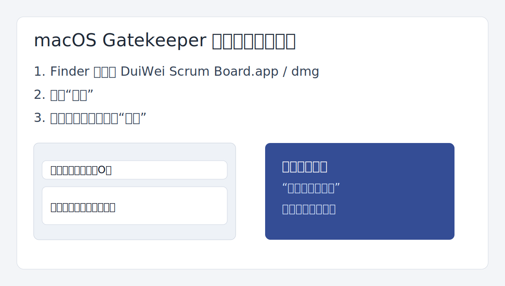
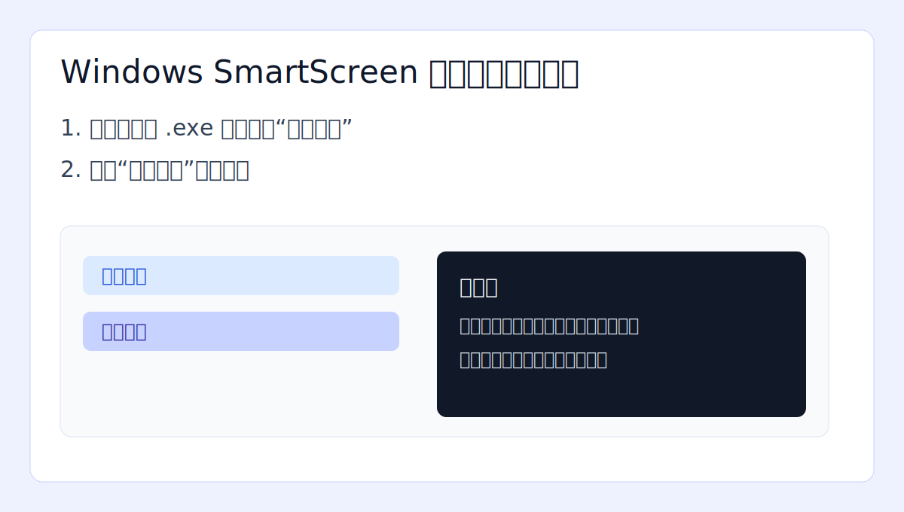

# 木质部看板安装说明

## 1. macOS 安装（`.dmg`）

1. 双击 `DuiWei Scrum Board-*.dmg`。
2. 将应用拖入 `Applications`。
3. 首次打开若被 Gatekeeper 拦截：
   - 在 Finder 中右键应用，选择 `打开`。
   - 在系统弹窗里再次点击 `打开`。



## 2. Windows 安装（`.exe`）

1. 双击 `DuiWei Scrum Board Setup *.exe`。
2. 出现 SmartScreen 提示时：
   - 点击 `更多信息`。
   - 再点击 `仍要运行`。
3. 按安装向导完成安装。



## 3. 首次启动检查

1. 启动应用后进入登录页。
2. 使用邮箱+密码注册或登录。
3. 确认可以看到公开任务看板。
4. 在 `设置` 中确认通知开关按需开启。

## 4. 开发环境启动（源码）

```bash
npm install
npm run dev
```

## 5. 打包命令

```bash
npm run build:mac
npm run build:win
```

产物目录：`release/`
